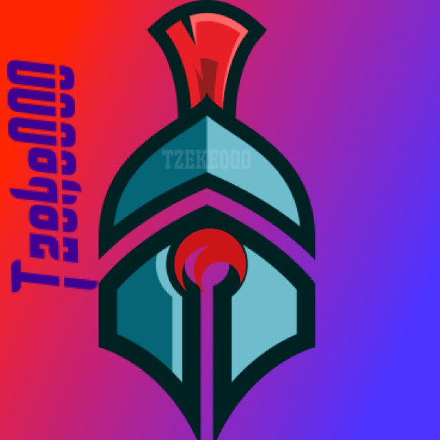

# Music Display

A 3D audio visualizer that turns a song + your artwork into a reactive video for
YouTube. Built for **Tzeke000 Studios** (Future Bass / EDM / Pop) with Three.js
and the Web Audio API.

Drop in an `.mp3` / `.wav` and an image (or let it pull the embedded cover art),
and the picture comes alive in 3D — dissolving into a cloud of points or pulsing
as a whole, reacting to the bass, mids, treble and beats.



## Quick start

```bash
npm install
npm run dev        # opens http://localhost:5173
```

Then:
1. **Drop a song** (`.mp3`/`.wav`) onto the window, or click **Choose song…**.
2. Optionally **Choose art…** (an image). If your MP3 has embedded cover art,
   it's used automatically; otherwise a branded placeholder is generated.
3. Press **Space** to play. Tweak the look in the **Look & Feel** panel.
4. Hit **● Record** to capture a video. It plays from the start and downloads a
   `.webm` when the track ends (or when you press Stop). WebM uploads directly
   to YouTube.

### Keyboard
- `Space` — play / pause
- `F` — fullscreen
- `R` — start / stop recording

## Display modes
- **Auto** — picks the best mode from how busy the picture is.
- **Particles** — the art dissolves into a reactive 3D point cloud.
- **Image** — the *whole picture* reacts to the bass (great for simple art).
- **Both** — faint reactive card + particle sparkle on top.

## Tips for a clean YouTube render
- Set **Output → Render size** to `1080p` (or `1440p`) before recording so the
  video is an exact resolution regardless of window size.
- Higher **Detail (count)** = crisper particle image but heavier on the GPU.
- For the best quality export, the offline MP4 renderer is on the roadmap
  (see [`notes/03-roadmap-todo.md`](notes/03-roadmap-todo.md)).

## Build a static version

```bash
npm run build      # outputs to dist/
npm run preview    # serve the production build
```

## Project memory
Design decisions and roadmap live in [`notes/`](notes/), a Markdown vault that
opens directly in [Obsidian](https://obsidian.md). Optional semantic recall via
mem0 is documented in [`notes/05-mem0-integration.md`](notes/05-mem0-integration.md).

## Tech
Three.js · Web Audio API · custom GLSL · Vite. See
[`notes/02-architecture.md`](notes/02-architecture.md) for the code map.
